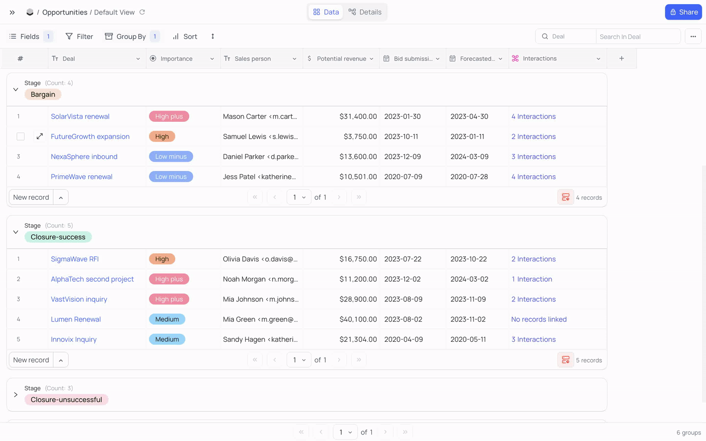

# NocoDB

[Сайт](http://www.nocodb.com/) • [Github](https://github.com/nocodb/nocodb) • [Документация](https://docs.nocodb.com/)

Open-source аналог Airtable с более простым, но с интересным функционалом.

### Плюсы

**Возможность подключать несколько внешних баз данных**

Отличная возможность в одном интерфейсе видеть несколько разных баз данных.
Можно в интерфейс подключить базу вашего приложения и получить из коробки: удобный интерфейс управления, REST API.

**Система хуков**

Можно отслеживать события вставки/изменения/удаления и отправлять http запросы в другой сервис.

**Проектирование базы в UI**

Быстро и удобно изменять схему базы данных, настраивать связи, индексы и т.д.

### Минусы

- Нельзя добавлять логику при сохранении и валидации
- Отображения могут работать только с одной таблицей - подгрузить поле из соседней таблицы нельзя
- Не красивые префиксы у адресов в REST API

### Подходит для задач

**Прием форм и обработка**

Можно создать форму через встроенный простой конструктор, поделиться ссылкой на форму и собирать ответы.
Ответы можно обрабатывать в интерфейсе - есть представление kanban.

Хорошо подойдет для сбора и обработки обратной связи или заявок, если вы, по какой-то причине не можете пользоваться облачными CRM системами.

**Админка и API для сайта**

Через UI можно собрать схему базы данных и сразу же получить REST API к этим таблицам.

Хорошо подойдет для создания каталогов, блогов, а так же для быстрого создания MVP продукта.
Идеально для frontend разработчиков.

